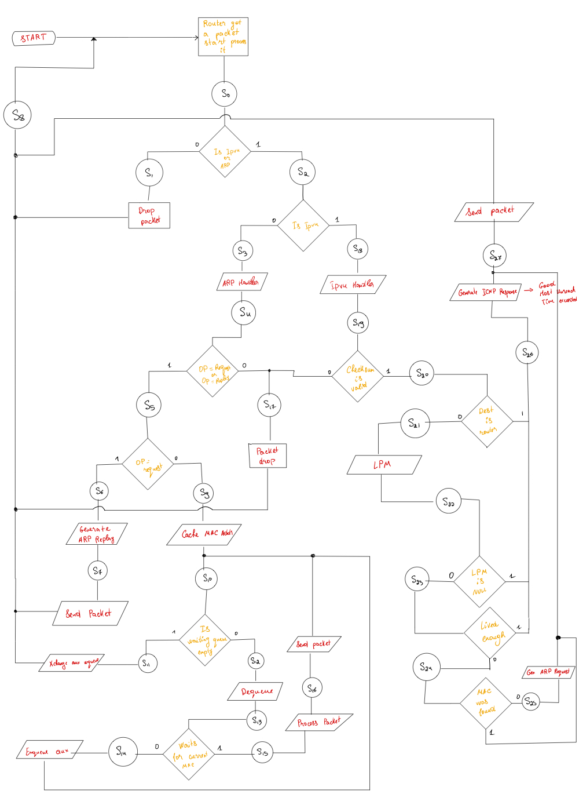

# Negru Mihai 323CD: PCom Assignment No. 1

## `Getting Started`

This `README` tries to explain how the assignment was done.
* Mainly here we will discuss the implementations and the motivation for choosing one idea over another.
* For more information you can lookup in the code for comments that explain details.
* The details as *"I set that fields to that value because of...."* can be found in the code at the following files:
    * [utils.c](./lib/utils.c)
    * [vector.c](./lib/vector.c)
    * [binary_trie.c](./lib/binary_trie.c)
    * [router.c](./router.c)

In the following sections we will go through the following ideas:
* Implementing the binary **Trie**
* Implementing the **router** functionality:
    * Forwarding mechanism
    * Handling ARP Requests/Replays
    * Handling ICMP Requests/Replays

## `Implementing the binary Trie`

### `Structure`

The binary *Trie* is a simple Binary Tree, with the following propreties:
* The left child adds **0** to matching
* The right child adds **1** to matching
* The root node is a dummy node
* Just some nodes contain actual information:
    * If the node has the `EMPTY` status it does not contain any valuable information
    * If the node has the `INFO` status than the node contains the `next hop` and the `next interface`

### `Constructing the routing table`

First we create a binary `Trie` with the above propreties, than we insert in the tree the following information:
* `Prefix` - for matching
* `Mask` - helps to insert just a number of bits from the prefix not the whole value
* `Next Hop` - the actual valuable information stored in the trie, does not have any effect on the insertion
* `Next Interface` - the actual valuable information stored in the trie, does not have any effect on the insertion

The process repeats until the routing table is complete (no more routes in the routing table file).

### `The process of inserting in the Trie`

The number of bits are calculated from the mask, an example can be:
```text
    For a mask value of 255.255.255.0
    we need to save just 24 bits from prefix
```

>**NOTE:** Let's say that the actual number of bits that must be stored in the trie are `prefix_length`

Now `prefix_length` number of bits are inserted from the `prefix` in the trie respecting the rules above:
* If the current bit is **0** the pointer moves to the left child
* If the current bit is **`** the pointer moves to the right child
* If the child is `NULL` and the insertion was not completed a new child is created and linked and the process continues until all `prefix_length` bits were inserted.

>**NOTE:** The children that are creating in the process of insertion have an **EMPTY** status and just the last `child` inserted will contain the actual information and a status of **INFO**.

### `The longest prefix match`

After inserting all the prefixes with all the information we can proceed with finding matches.

For matching a prefix and finding the next hop we just need a simple address.

The bits of the input `addr` are matched with the trie structure:
* If the current bit from the `addr` is **0** we point to the next left child
* If the current bit from the `addr` id **1** we point to the next right child
* If in the process of iterating we found a node with the status **INFO** we copy the
`next hop` and `interface` and continue with the iterations
* The process stops when we hit a `NULL` node
* The **last match** will be the longest prefix match for the current address

>**NOTE:** The LPM algorithm returns a pointer to an allocated `hop_info_t` structure which contains the actual information about a prefix and the next hop and interface.

>**NOTE:** For each LPM the search is at most **32** operations, which means that `T(LPM) in O(Size(mask) that matches the address)` 

## `Implementing the router`

First the router is created as a `structure` (I try to preserve the encapsulation), here in the creation of the router the routing table trie is created and computed, also the cache storage for following MAC addresses is allocated.

Then the process of router *hard working* begins as a infinite loop.

The router listens from all interfaces, when it gets a packet (returns from the blocking function call), checks if the interface is a valid one, if the interface is not a valid one it means that the connection cannot be done so the router ends its life.

If the interface passes, the router extracts the `ethernet` header and checks if the packet is a **IPv4** or an *ARP* message, then the special **routers handlers** are called to handle the message.

>**NOTE:** If the packet is not an IPv4 or an ARP the packet gets dropped and the router continues its work with no stress.

>**NOTE:** The messages router handlers should be transparent for the user, as they are allocated into a static context in the **[utils.c](./lib/utils.c)** and should just be called by the user.

>**NOTE:** The router API works just a framework.

### `Forwarding`

>**NOTE:** For this router application it can only process ipv4 for forwarding, ipv4 + icmp for forwarding and replayings to it and arp for finding the mac address.

The **IPv4** handler was called from the router context.

The **IPv4** header is initialized from the message and the checksum is calculated.<br>
If the checksum is bad than the packet is dropped and the router continues to listen from its interfaces.

If the `checksum` is good than the router checks if the message was send for it (in order to process it and send a replay) or to forward to the next hop.

If the `message` was send for the router, it generates an **ICMP Response** and sends it back to the interface that it got the message.

If the `message` has to be send to another node from the network it first computes the **Longest match prefix**. If no address was found for the router generates an **ICMP Replay** with **Host Unreachable** message and sends it back to the interface that it got the message.

However if it has found a route it looks at the `Time to Live` field. If the `ttl` is 1 tha the packet is dropped and router generates an **ICMP Replay** with **Time Excedded** message and also sends it back to the interface that it got it.

If the packet can live the hard work that it has done, the `ttl` is decrementing and the checksum is calculated again (here I first recalculate the checksum and then I decrement the ttl,it is pure relating to codingstyle).

After all the calculations were done the router tries to finds the **MAC address** for the `next hop` in the cache memory. If the MAC address is not found the current message is saved in a **waiting queue** and an **ARP Request** is generated and it is send to the `hop's` interface as a broadcast message, if the MAC address was found the `ethernet header` is updated to for the next hop (mac source is router, mac dest is next hop) and the packet is sent to the next hop.

>**NOTE:** When generating the arp request for finding the mac address. the ipv4 header is changed with an arp header and the mac address for the ethernet header is set as `ff:ff:ff:ff:ff:ff` (broadcast) and it is send to the interface that point to the next hop, it is not sent over all interfaces.

### `ICMP Replays`

If an **ICMP Replay** is generated by the router, with any messages specified above, we update the icmp header with the correct `type` and `code` and we recalculate the checksum.

Then a new ipv4 header is generated, where the destination ip address is the source address of the **ipv4** packet.

In case that the **ICMP Replay** is time limit or host unreachable, we copy after the icmp header the original *ipv4* message that generated this fault and the next 64 bits (8 bytes) of padding from the original ipv4 message.

Then the ethernet header is updated and the message is sent to the interface that it has come from.

### `ARP Requests and Replays`

The router has got an arp packet, first it checks if the arp packet is a *request* or a *response*, if it is a request message, the router generates an arp replay message and sends it back to the interface that it has got the request in order to send the replay to the source.

The arp replay is generated as:
* The target ip address is set as the source ip address
* The target mac address is set as the source mac address
* The source ip address is set as the ip address of the router's interface that has got the message
* The source mac address is set as the mac address of the router's interface that has got the message
* The ethernet header is updated and then the replay is sent back to the source

If the arp message is an **ARP Replay** the router does the following actions:
* Caches the mac address of the response to use it in other cases (not to generate an ARP request every time it has to forward a packet)
* Iterates over the `waiting queue` and sends every packet that was waiting for the mac address from the arp replay:
    * The ethernet and ip headers are computed from the waiting packet and the mac address from the arp replay is updated in the ethernet header than the packet is sent to the **next hop** over the computed interface in the routing table.

### `Logic scheme block for the router program`



For any details or clarifications be free to contact me to the following email address "determinant289@gmail.com"
